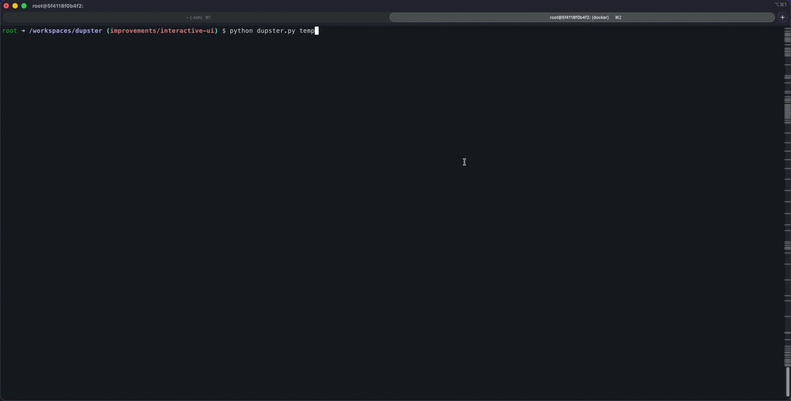

# Dupster

**A very easy terminal UI for finding duplicates when you're stuck in the terminal like me and would rather see your duplicates files than memorize CLI flags.**

<div align="center"> 



[](https://github.com/karimz1/dupster/actions/workflows/ci.yml)
[](https://opensource.org/licenses/Apache-2.0)
[](https://www.python.org/downloads/)
[](https://github.com/karimz1/dupster/releases)
[](https://github.com/karimz1/homebrew-dupster)
[](https://github.com/sponsors/karimz1)

</div>

------

### Why I built this

I mostly made this because I wanted to actually *see* what I was deleting without leaving the terminal. If you've ever SSH'd into a remote Linux server and felt a bit nervous running a bulk-delete command on a bunch of duplicate files, you'll get why I made this.

I wanted a tool where I didn't have to remember complex flags or commands. I wanted something that:

- **Feels like a desktop app:** An interactive list where you can scroll and check things.
- **Groups everything visually:** You can see exactly which files are clones / duplicates of each other in a single group.
- **Shows the details:** It shows you the file hash so you can be 100% sure that "ah, okay, these really are the same" before you hit delete.

It’s basically a "middle ground" for people who like the terminal but miss the visual clarity of a GUI.

**Note on Speed:** This is a hobby project and it is **not fast** yet. It does a full SHA-256 hash on every file to make sure it's 100% accurate. If you're scanning big files, it will take a while. I’m working on making it faster.

------

### Current limitations & "Maybe" features

Since I'm just building this for fun/utility, there are a few things it doesn't do yet:

- **Speed:** It’s slow on large datasets because it doesn't pre-filter by file size yet.
- **OS Support:** Works great on macOS and Linux. Windows is still a bit hit-or-miss.

------

### Installation

**Homebrew** (Recommended so you can get easy updates)

```bash
brew tap karimz1/dupster
brew install karimz1/dupster/dupster-cli
```

**From Source**

```bash
git clone https://github.com/karimz1/dupster.git
cd dupster
pip install .
```

------

### How to use it

Just point it at a directory:

```bash
dupster ~/Downloads
```

**Controls:**

You will see all controls and shortcut in the UI when you start dupster but here is a little list:

- `s`: Start the scan.
- `h` / `l`: Move between the list and the file details.
- `o`: Open the file (to double-check it's the one you want).
- `i`: **Keep only this** (Deletes all other duplicates in that group).
- `d`: **Delete all** (Removes the whole group).
- `q`: Quit.

------

### How it compares

If you actually need raw speed for massive amounts of data, I highly recommend these instead:

**Disclamer** Not affiliated at all. I just use their tools and honestly, they’re incredible.

- [fclones](https://github.com/pkolaczk/fclones) - Incredible speed, written in Rust.
- [fdupes](https://github.com/adrianlopezroche/fdupes) - The standard tool most people use.
- [rdfind](https://github.com/pauldreik/rdfind) - Great for replacing dupes with links.

**Dupster** is just for when you want to "see" what's happening in a terminal ui and don't want to memorize all CLI flags, I must admit I'm kinda this person.

------

### Contributing

If you're a developer and want to help me make this faster, I'd love the help. It’s mostly a learning / side-project for me, so if you want to fork it and open a PR with performance improvements (like file-size filtering or multi-threading), I'd be happy to add you as a co-author.

- **Tests:** Run `pytest -v`.
- **Dummy Data:** I included a script at `tools/generate_dupes.py` that creates a folder of fake duplicates so you can test things without breaking your real files.

**Author:** [Karim Zouine](https://github.com/karimz1)

**License:** Apache 2.0
